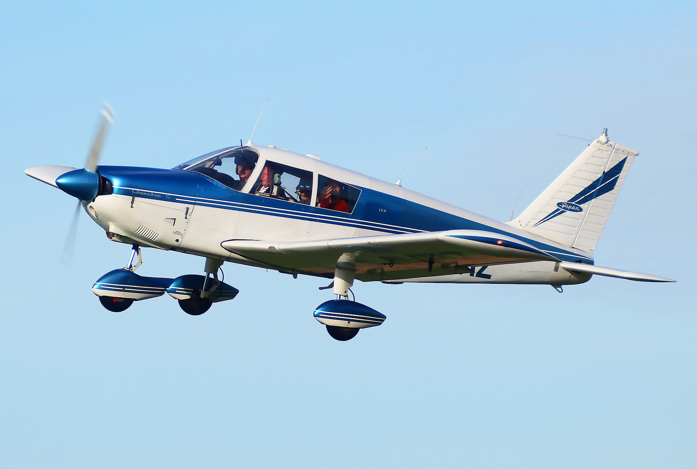
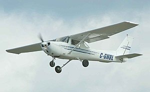
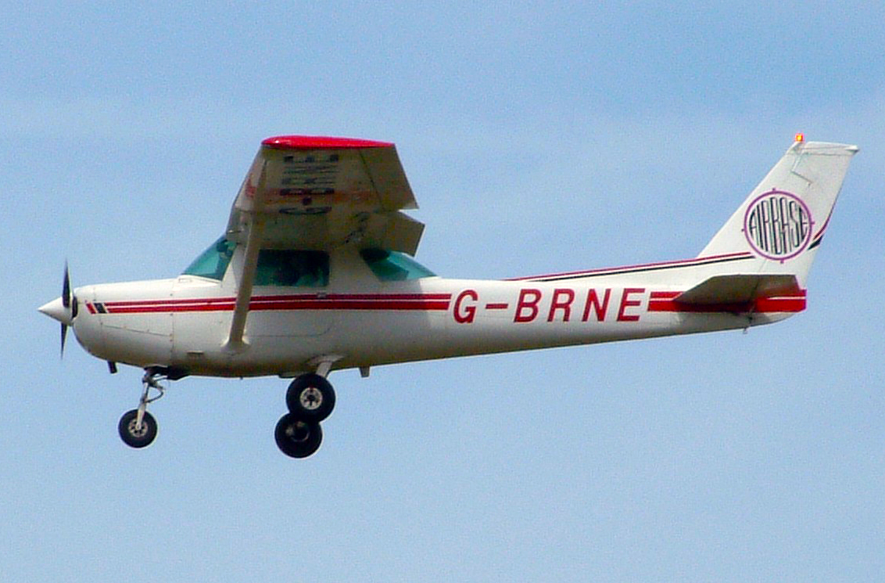
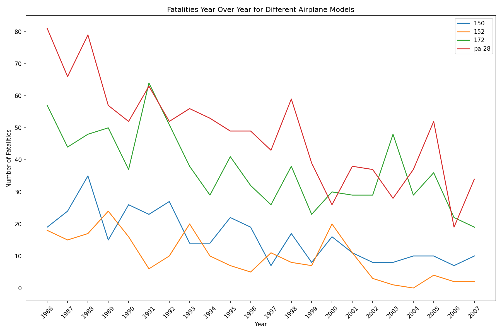
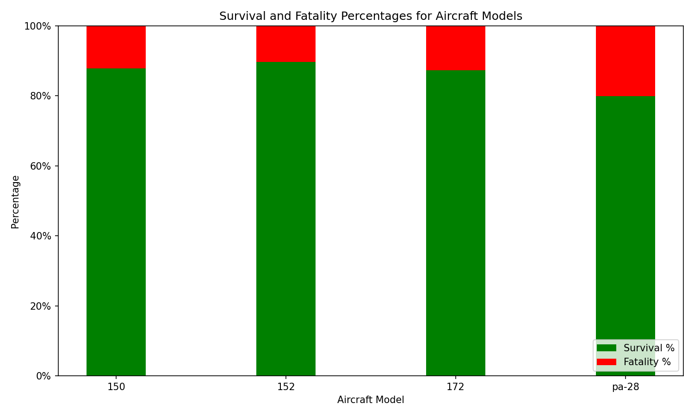
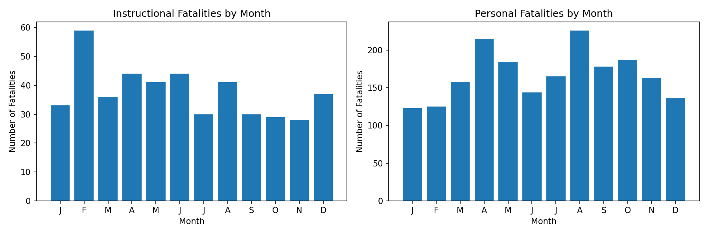
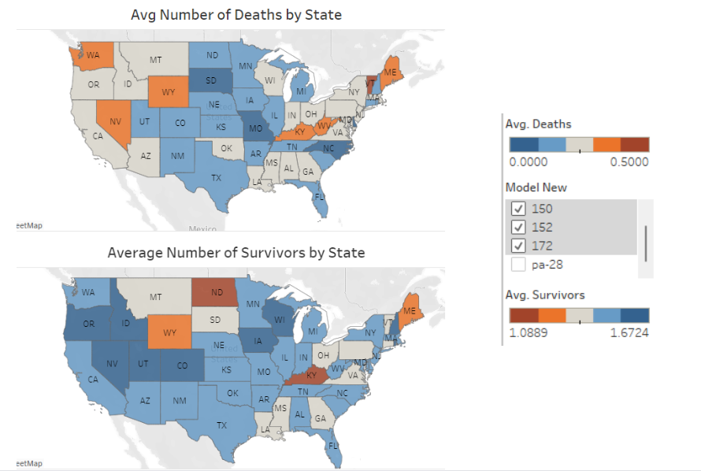

# Make Flying Safer by Choosing the Right Plane

**Authors**: David Johnson, Johnathan Yater, and Trashae Wiseman

## Overview

This project analyzes the risks associated with specific make and model aircraft. A descriptive analysis of aviation accident data reveals variations in the frequency of fatal incidents among different planes. Additionally, it offers insights into the timing patterns of accidents throughout the year and highlights specific geographical regions within the continental U.S. where airplane accidents are more prevalent. Our recently established aviation school can leverage this analysis to make informed decisions on aircraft investments, pinpoint suitable locations for our operations, and develop well-timed lesson schedules.

## Business Problem

Our company is embarking on establishing a new flight school, with a primary focus on ensuring the safety of our students and bringing up a new generation of pilots. Our business will be broken into two stages for our students. First, the instructional phase where students will learn how to fly with instructor assistance. Second, the rental phase where after completing stage 1, students will be able to rent planes to log solo flight hours to gain their pilot's license. To make informed decisions about the selection of aircraft for our training and rental fleet, we need a clear and visually insightful way to compare the safety records of different aircraft models.

We will specifically investigate the most commonly used aircraft in flight schools. According to the [Pilot Institute](https://pilotinstitute.com/flight-school-aircraft/) and the [Aircraft Owners and Pilots Association](https://www.aopa.org/training-and-safety/learn-to-fly/flying-for-fun/choose-where-to-train/training-aircraft-review#:~:text=Cessna%20172%3A%20The%20Cessna%20172,%2Dinjected%20four%2Dcylinder%20engines.), the top aircraft make and models used in flight school are the Cessna 172, Piper PA-28 Cherokee, Cessna 150, and Cessna 152.

### Cessna 172


### Piper PA-28 Cherokee


### Cessna 150


### Cessna 152


**The Task:**
1. Which of these makes and models is the safest to fly?
2. What time of year provides for the safest flying conditions?
3. Where should we open our first location?

## Data

In this analysis, aviation accident data was taken from the [National Transportation Safety Board](https://www.kaggle.com/datasets/khsamaha/aviation-accident-database-synopses/data?select=AviationData.csv) and was sourced from Kaggle. This aviation accident database, encompassing data from 1962 onwards, provides comprehensive information on civil aviation accidents and selected incidents within the United States, its territories, possessions, and international waters. The dataset includes details about the number of injuries and survivors resulting from each incident, along with information about the make and model of the involved aircraft.

## Methods

This project uses descriptive analysis, including description of trends over time and heatmaps. This provides a useful overview of how safe a flight is.

## Results

Over the years 1986 to 2007, the analyzed aircraft models, including the Cessna 150, Cessna 152, Cessna 172, and Piper PA-28, exhibited a consistent decrease in total fatalities, reflecting advancements in safety measures and technology. Among the four-seaters, the Cessna 172 showed fewer fatal injuries than the Piper PA-28, while in the two-seater category, the Cessna 152 demonstrated improved safety compared to the Cessna 150.



The Cessna 152 stands out with the highest overall survival rate at 89.63%, indicating a relatively higher likelihood of passengers and crew surviving incidents. In contrast, the Piper pa-28 shows a slightly lower overall survival percentage at 79.90%, suggesting a comparatively lower average survival rate. The Cessna 150 and Cessna 172 fall within a similar range, both around 87%, indicating comparable safety performance. These brief observations highlight differences in safety outcomes among the selected aircraft models.



The comparative analysis of instructional and personal flights reveals a consistent safety trend in instructional flights throughout the year, with a minor peak in February. In contrast, personal flights exhibit higher fatalities during summer months, emphasizing the importance of season-specific risk assessments for flight planning.



The Tableau heatmap visual highlights a distinct pattern, indicating that the Midwest region consistently exhibits the lowest average number of fatalities compared to other continental U.S. regions. Additionally, the Midwest region stands out for having the highest average number of survivors, underscoring its positive safety record in aviation incidents. Given that the Cessna models demostrated a higher survival percentage compared to the Piper model, we only examined the Cessna models in this visual.

Click [here](https://public.tableau.com/views/AviationIncidentAnalysis/Dashboard1?:language=en-US&:display_count=n&:origin=viz_share_link) to view our interactive Tablaue dashboard.




## Conclusions

This analysis leads to four recommendations for starting our flight school business:

- **Invest in a Cessna model aircraft.** The Cessna 152 stands out with the highest overall survival rate at 89.63%, followed closely by the Cessna 150 and 172 at ~87%. The Piper pa-28 showed the lowest overall survival percentage at 79.90%. 
- **Pay a little extra for a newer model plane.** Technology has evolved drastically since the inception of all these models of interest, and it is clear that over the years these planes have shown themselves to be safer.
- **Tailored risk assessments for flight planning.** Instructional flights consistently maintain lower fatality rates throughout the year, with a minor peak in February, while personal flights show a distinct seasonal pattern, peaking in fatalities during summer months (April and August). Flight planning considerations suggest scheduling instructional flights year-round and personal flights, preferably from October to March.
- **Open first location somewhere in the midwest region.** the Midwest region consistently exhibits the lowest number of fatalities compared to other continental U.S. regions. Additionally, the Midwest region stands out for having the highest average number of survivors, underscoring its positive safety record in aviation incidents.

### Next Steps

Further analyses could yield additional insights to how we can further improve our flight schools saftey:

- **Determine the best location based on stakeholder preference.** We would need to explore real estate costs and then determine whether leasing or purchasing would be most ideal along with analyzing competition.
- **Determine overhead costs.** We would need to determine overhead costs such as planes, cost around employing experienced certified instructors, government regulations, and upkeep. Additional research around profit/loss/cost would need to be assessed along with understanding FAA requirements and exploring government regulations.
- **Analyze weather conditions in location choice.** We would need to further analyze how weather impacted fatalities in the seasons in order to determine when would be most ideal to promote instructional classes.

## For More Information

See the full analysis in the [Jupyter Notebook](./flight_school_plane_analysis.ipynb) or review this [presentation](./Animal_Shelter_Needs_Presentation.pdf).

## Repository Structure

```
├── data
├── images
├── README.md
├── flight_school_plane_analysis_presentation.pdf
└── flight_school_plane_analysis.ipynb
```